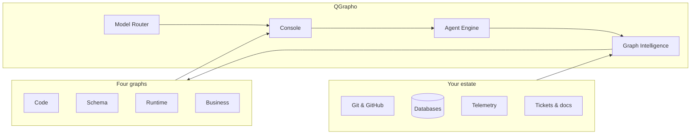
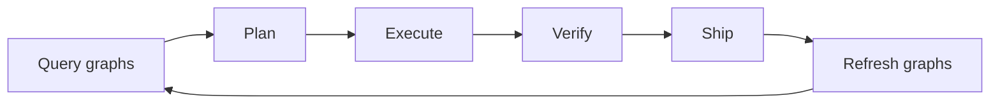

<div align="center">

# QGrapho

**The graph-native operating system for software organizations.**

Understand everything · Act autonomously · Ship with confidence

<br/>

[](https://github.com/quanvio/qgrapho/blob/main/LICENSE)
[](https://github.com/quanvio/qgrapho/blob/main/ROADMAP.md)
[](https://github.com/quanvio/qgrapho/tree/main/docs)
[](https://github.com/quanvio/qgrapho/blob/main/pyproject.toml)
[](https://quanvio.com)

<br/>

[Why QGrapho](#why-qgrapho) · [Features](#features) · [Quick start](#quick-start) · [Docs](docs/) · [Roadmap](ROADMAP.md)

</div>

> **Early preview** — Documentation, CLI scaffold, and project layout are live. Console, Agent Engine, and graph indexing are in active development. Track progress in **[ROADMAP.md](ROADMAP.md)**.

---

## The problem

Large engineering organizations drown in **fragmented context**:

| Source | Pain |
|--------|------|
| Code | Thousands of files across hundreds of repositories |
| Schema | Tables, migrations, and lineage scattered everywhere |
| Runtime | Behavior buried in logs and dashboards |
| Business | Decisions in tickets and chat — disconnected from code |

AI agents that grep blindly do not scale to **100k+ files**, **1000+ services**, or **1000+ database tables**.

---

## The solution

**QGrapho** continuously builds **four living graphs** and connects them to autonomous agents that understand, plan, execute, verify, and ship.

| Graph | What it captures |
|:------|:-----------------|
| **Code** | Symbols, calls, dependencies, ownership |
| **Schema** | Tables, columns, migrations, lineage |
| **Runtime** | Services, traces, latency, failures |
| **Business** | Tickets, specs, decisions over time |



**Autonomous loop:** query → plan → execute → verify → ship → refresh graphs



**Modalities:** text · code · vision · documents · audio · embeddings · tools — routed by **Model Router**

---

## Why QGrapho

| Capability | Traditional AI coding tools | QGrapho |
|:-----------|:----------------------------|:--------|
| **Context** | File search and embeddings | Four unified graphs |
| **Scale** | Single repository | Estate-wide (100k+ files) |
| **Models** | Vendor lock-in | Bring your own — unlimited providers |
| **Deploy** | Containers required | **Native by default** |
| **Modalities** | Text only | Text, vision, docs, audio, images, embeddings |
| **Experience** | Mixed tooling | One product, one brand |

Built for **platform teams**, **staff engineers**, and **organizations** that need more than a chat box in an IDE.

---

## Features

<details open>
<summary><strong>Graph intelligence</strong></summary>

Deterministic code, schema, runtime, and business graphs — queryable by agents and humans.

</details>

<details open>
<summary><strong>Autonomous agents</strong></summary>

**QGrapho Console** coordinates work. **QGrapho Agent Engine** executes in a lightweight native sandbox.

</details>

<details open>
<summary><strong>Model router</strong></summary>

Connect any OpenAI-compatible provider. Smart routing by task: chat, code, vision, documents, embeddings.

</details>

<details>
<summary><strong>Multimodal</strong></summary>

Screenshots, PDFs, diagrams, meeting audio, generated assets — routed to the right model automatically.

</details>

<details>
<summary><strong>Native-first</strong></summary>

Runs on your laptop with zero containers. Optional isolation and scale profiles when you need them.

</details>

---

## Quick start

### Install

**Windows**

```powershell
irm https://raw.githubusercontent.com/quanvio/qgrapho/main/scripts/install.ps1 | iex
```

**macOS / Linux**

```bash
curl -fsSL https://raw.githubusercontent.com/quanvio/qgrapho/main/scripts/install.sh | bash
```

### Configure

```bash
qgrapho init          # pick your model provider + workspace
qgrapho doctor        # verify installation
qgrapho index .       # build Code Graph (Phase 1)
qgrapho start         # launch Console + Agent Engine (Phase 0)
```

| Requirement | Detail |
|-------------|--------|
| RAM | 4 GB minimum |
| OS | Windows 10+ · macOS 12+ · Linux |
| Models | One LLM API key or local models (Ollama) |

Full guide → **[Getting started](docs/getting-started.md)**

---

## Repository structure

```
qgrapho/
├── src/qgrapho/          # Python CLI
├── services/             # Graph API, projectors, event bridge
├── mcp/                  # Graph Intelligence MCP
├── deploy/profiles/      # native · isolated · scale
├── config/               # Example config & presets
├── docs/                 # Documentation
└── ROADMAP.md            # Phases & status
```

---

## Documentation

| Guide | Description |
|-------|-------------|
| [Getting started](docs/getting-started.md) | First session in 10 minutes |
| [Installation](docs/installation.md) | Profiles, upgrades, troubleshooting |
| [Architecture](docs/architecture.md) | Platform design and four graphs |
| [Models and providers](docs/models.md) | BYOK, presets, smart routing |
| [Capabilities](docs/capabilities.md) | Vision, docs, audio, embeddings |
| [Configuration](docs/configuration.md) | Complete reference |
| [Roadmap](ROADMAP.md) | What works today and next phases |

---

## Who is this for?

- **Engineering leaders** modernizing estates too large for one team to hold in memory
- **Platform teams** building internal developer intelligence
- **Staff engineers** tracing impact across services, schemas, and decisions
- **AI-native organizations** that want agents grounded in truth, not hallucinated file trees

---

## Community

| Channel | Link |
|---------|------|
| Issues and features | [github.com/quanvio/qgrapho/issues](https://github.com/quanvio/qgrapho/issues) |
| Website | [quanvio.com](https://quanvio.com) |
| Organization | [github.com/quanvio](https://github.com/quanvio) |

If QGrapho helps your team, **star the repo** — it helps others discover graph-native engineering.

---

## License

MIT © [Quanvio](https://quanvio.com). See [LICENSE](LICENSE).

<div align="center">
<sub>QGrapho — understand everything. Act autonomously.</sub>
</div>
