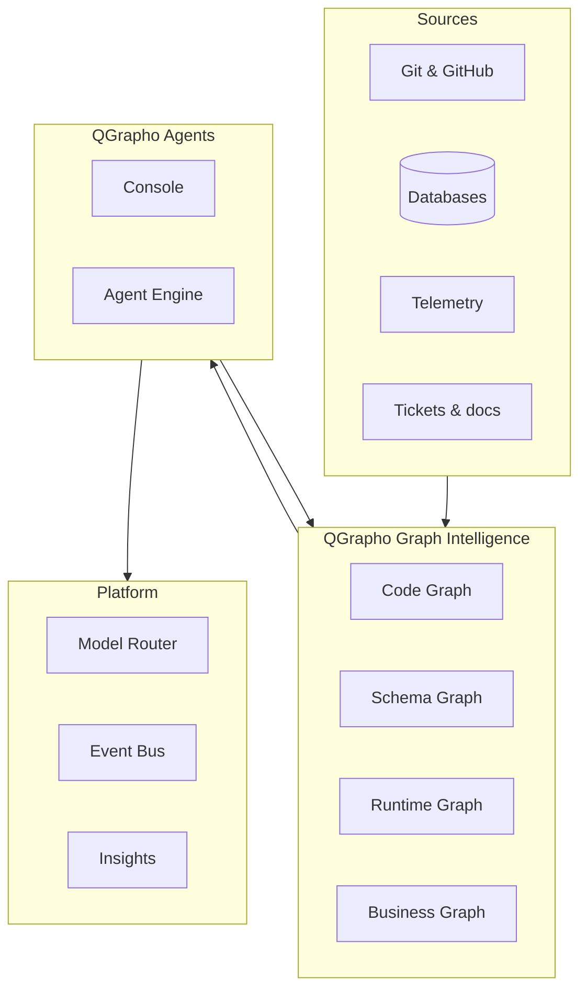

# Architecture

How QGrapho is designed — product view only.

---

## Overview

QGrapho is a **graph-native autonomous engineering platform**. It ingests signals from your estate, maintains four graphs, and powers agents that act on verified context.



---

## Product components

| Component | Role |
|-----------|------|
| **QGrapho Console** | Coordinator UI — sessions, swarm, tools |
| **QGrapho Agent Engine** | Executes tasks — shell, git, tests, pull requests |
| **QGrapho Graph Intelligence** | Indexes and queries the four graphs |
| **QGrapho Model Router** | Routes tasks to your chosen models & modalities |
| **QGrapho Event Bus** | Async jobs and graph refresh (optional early) |
| **QGrapho Insights** | Traces, cost, quality (optional early) |

All components ship under the **QGrapho** brand. You install one product — not a bag of unrelated tools.

---

## The four graphs

### Code Graph
AST-level structure: symbols, imports, calls, routes, dead code paths.

**Producers:** repository indexing, SCIP-class indexers, live file watchers  
**Questions answered:** Who calls this function? What breaks if I change this module?

### Schema Graph
Tables, columns, ORM models, migrations, column-level lineage.

**Producers:** database introspection, migration parsers, catalog ingestion  
**Questions answered:** Which service writes to this table? Where does this column flow?

### Runtime Graph
Service topology from traces: calls, latency, errors, deployments.

**Producers:** OpenTelemetry and APM telemetry  
**Questions answered:** What failed after the last deploy? Which path is slow?

### Business Knowledge Graph
Temporal facts from tickets, docs, chat, and domain analysis.

**Producers:** MCP connectors, document ingestion, domain extraction  
**Questions answered:** Why was this decision made? What did we agree in Q3?

---

## Autonomous loop

Every agent workflow follows the same contract:

```text
Query graphs → Plan → Execute → Verify → Ship → Refresh graphs
```

| Phase | Responsibility |
|-------|----------------|
| Query | Graph Intelligence + Model Router (when interpretation needed) |
| Plan | Console + reasoning model |
| Execute | Agent Engine |
| Verify | QGrapho test & validation layer |
| Ship | Git, CI, GitOps |
| Refresh | Event Bus triggers re-index |

---

## Deployment profiles

| Profile | Containers | Use case |
|---------|------------|----------|
| **native** (default) | None | Daily development, trusted repos |
| **isolated** | Optional one | Untrusted code, shared machines |
| **scale** | Optional K8s | Many parallel workers, HA |

**Native is the default.** Podman, Docker, and Kubernetes are optional — never required to start.

---

## Model & modality layer

QGrapho Model Router accepts **unlimited providers** via OpenAI-compatible APIs.

Routes include:

- **Text:** chat, code, plan, agent, reasoning  
- **Vision:** screenshots, UI, diagrams  
- **Documents:** PDF, Confluence, long RFCs  
- **Media:** image generation, audio in/out, video  
- **Search:** embeddings and semantic retrieval  

See [Models & providers](models.md) and [Capabilities](capabilities.md).

---

## Scale path

| Stage | Estate | Profile |
|-------|--------|---------|
| 1 | One repository | native |
| 2 | Team, few services | native + Event Bus |
| 3 | Many services | isolated or dedicated server |
| 4 | Enterprise | scale |

You get value at stage 1. Stage 4 is for organizations that outgrow a single machine — not a day-one requirement.

---

## Design principles

1. **Graphs are the product** — agents exist to keep graphs fresh and actionable  
2. **Compose, don't reinvent** — QGrapho integrates proven engines behind one brand  
3. **Native by default** — minimal RAM, no mandatory containers  
4. **Bring your own models** — no lock-in to any LLM vendor  
5. **Verify before ship** — no autonomous merge without validation  
6. **Temporal truth** — business facts have validity windows, not just embeddings  

---

## Related docs

- [Concepts](concepts.md) — glossary & loops  
- [Configuration](configuration.md) — settings reference  
- [Installation](installation.md) — deploy profiles  
