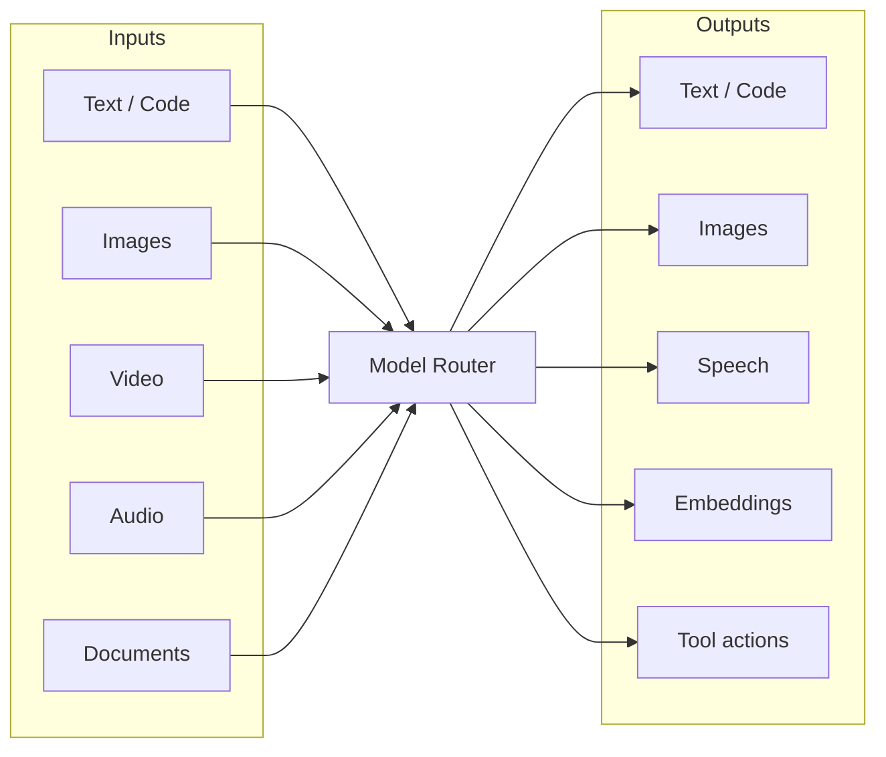

# Capabilities & modalities

QGrapho routes **every kind of AI workload** — not just text chat. One config, unlimited providers, smart picks per modality.



At giant scale (100k+ files, 1000+ services), agents need **text, vision, documents, embeddings, generated assets, and voice** — often in the same workflow. QGrapho Model Router handles all of it.

---

## Modality matrix

| Modality | Input | Output | Example agent task |
|----------|-------|--------|-------------------|
| **Text / code** | Prompt, source files | Text, patches | Fix bug, write feature |
| **Vision (image in)** | Screenshot, diagram, mockup | Text, graph nodes | “What does this UI do?” |
| **Image out** | Text prompt | PNG, SVG | Generate icon, diagram draft |
| **Video in** | Recording, demo clip | Text, steps | Parse bug repro video |
| **Video out** | Script, storyboard | Video clip | Marketing / demo asset |
| **Audio in** | Voice, meeting | Text, tickets | Standup → Jira tasks |
| **Audio out** | Text | Speech | Voice summary of PR |
| **Documents** | PDF, DOCX, Confluence HTML | Text, entities | RFC → Business Graph |
| **Embeddings** | Text chunks | Vectors | Semantic search + graph RAG |
| **Tools / agents** | Messages + tool calls | Actions | Shell, git, browser, MCP |
| **OCR / diagram** | Scan, whiteboard photo | Structured text | Architecture photo → graph |
| **Multimodal** | Text + image + file | Text | Kimi K2.6 full-stack understanding |

Configure each model’s **capabilities** once. Router picks the right model per task.

---

## Extended smart routing

Add routes for every modality in `~/.qgrapho/config.toml`:

```toml
[routing]
# ── Core (text) ──
chat   = "deepseek/deepseek-v4-flash"
fast   = "deepseek/deepseek-v4-flash"
code   = "deepseek/deepseek-v4-pro"
plan   = "moonshot/kimi-k2.6"
agent  = "grok/grok-4.3"
reason = "moonshot/kimi-k2-thinking"

# ── Vision & documents ──
vision    = "openai/gpt-4o"              # screenshots, UI, diagrams
diagram   = "moonshot/kimi-k2.6"         # architecture images → structure
doc       = "moonshot/kimi-k2.6"         # long PDF / Confluence
ocr       = "openai/gpt-4o"              # scanned docs, whiteboards

# ── Generation ──
image_out = "openai/dall-e-3"            # generate images
video_out = "grok/grok-imagine-video"    # generate video (when enabled)

# ── Audio ──
audio_in  = "openai/whisper-1"           # transcribe
audio_out = "openai/tts-1"               # speak

# ── Search & memory ──
embed     = "openai/text-embedding-3-large"
search    = "openai/text-embedding-3-small"
```

CLI:

```bash
qgrapho model suggest --full     # all modality routes
qgrapho route set vision openai/gpt-4o
qgrapho doctor --modalities      # test each route
```

Session override: `/model vision openai/gpt-4o`

---

## Model capability fields

Each `[[providers.models]]` entry declares what it supports:

```toml
[[providers.models]]
id = "gpt-4o"
label = "GPT-4o"
context_window = 128000
tags = ["chat", "code", "plan", "vision", "doc"]

[providers.models.modalities]
input  = ["text", "image", "file"]
output = ["text"]

[providers.models.modalities.features]
tools      = true
streaming  = true
json_mode  = true
thinking   = false
```

```toml
[[providers.models]]
id = "kimi-k2.6"
tags = ["vision", "doc", "agent", "plan", "video_in"]

[providers.models.modalities]
input  = ["text", "image", "video", "file"]
output = ["text"]
```

```toml
[[providers.models]]
id = "dall-e-3"
tags = ["image_out"]

[providers.models.modalities]
input  = ["text"]
output = ["image"]
```

Router **only sends work to models that declare the capability**. No silent failures.

---

## Provider capability cheat sheet

| Provider | Text | Vision in | Image out | Video | Audio | Embed | Tools |
|----------|------|-----------|-----------|-------|-------|-------|-------|
| **OpenAI** | gpt-4o, gpt-4o-mini | gpt-4o | dall-e-3 | sora* | whisper, tts | embedding-3-* | ✅ |
| **DeepSeek** | v4-flash, v4-pro | — | — | — | — | — | ✅ |
| **Moonshot / Kimi** | k2.6, k2.5 | k2.6 (native multimodal) | — | k2.6 video in* | — | — | ✅ |
| **Grok / xAI** | grok-4.3 | ✅ | Grok Imagine API | Grok Imagine | Grok Voice API | — | ✅ |
| **Ollama (local)** | llama, qwen, … | llava, moondream | — | — | — | nomic-embed | varies |
| **OpenRouter** | many | many | many | varies | varies | varies | varies |
| **QGrapho Cloud** *(optional)* | Hosted models | if enabled | if enabled | — | — | if enabled | ✅ |

\* Availability depends on your account / region — `qgrapho model list` shows what you have.

---

## Giant-scale patterns

### 1. Vision + Code Graph

```
Screenshot of error UI
  → vision model describes UI state
  → Graph Intelligence maps to components / routes
  → Agent Engine patches code
  → QGrapho Verification re-screenshots → vision verifies
```

### 2. Document → Business Graph

```
Confluence PDF / RFC
  → doc route (Kimi K2.6 or gpt-4o)
  → entities + decisions extracted
  → Business Knowledge Graph (temporal facts)
```

### 3. Diagram → Architecture Graph

```
Whiteboard photo / Excalidraw export
  → diagram route
  → services + edges inferred
  → merged into Code / Business graphs
```

### 4. Embeddings at estate scale

```
100k files chunked
  → embed route (batch)
  → vectors stored beside graph nodes
  → semantic_search + query_graph together
```

### 5. Multi-provider cost control

```toml
[routing]
fast   = "deepseek/deepseek-v4-flash"    # 90% of calls
code   = "deepseek/deepseek-v4-pro"
vision = "openai/gpt-4o"                # only when image attached
plan   = "moonshot/kimi-k2.6"           # weekly architecture only

[budgets]
daily_usd = 50
warn_at   = 0.8
```

### 6. Fallback chains

```toml
[[routing.fallback]]
route = "code"
try   = ["deepseek/deepseek-v4-pro", "openai/gpt-4o", "grok/grok-4.3"]
```

If primary is down or over budget, router tries next.

### 7. Fleet scale (1000+ agents)

| Layer | Scale approach |
|-------|----------------|
| Text agents | Route to fast/cheap models by default |
| Vision jobs | Dedicated vision pool, queue via Event Bus |
| Embeddings | Batch jobs via Event Bus, off-peak |
| Image gen | Rate-limited, separate API keys |
| Documents | Stream ingest → Business Graph, not inline chat |

---

## File & media in agent workflows

QGrapho Console and Agent Engine accept attachments:

| Attachment | Routed via | Stored in |
|------------|------------|-----------|
| `.png` / `.jpg` screenshot | `vision` | session + optional graph |
| `.pdf` / `.docx` | `doc` | Business Graph episode |
| `.mp4` demo | `video_in` | ticket context |
| `.wav` / `.mp3` | `audio_in` → transcript | Slack/Jira thread |
| Mermaid / SVG diagram | `diagram` | Code Graph enrichment |
| Repo file | Graph Intelligence | Code Graph (not LLM ingest) |

**Rule:** structural code knowledge goes through **Graph Intelligence** (deterministic). LLM vision/doc routes are for **interpretation**, not replacement of the Code Graph.

---

## Local & air-gapped multimodal

No cloud required for basic multimodal:

```toml
[[providers]]
id = "ollama"
base_url = "http://localhost:11434/v1"

  [[providers.models]]
  id = "llava"
  tags = ["vision"]

  [[providers.models]]
  id = "moondream"
  tags = ["vision", "fast"]

  [[providers.models]]
  id = "nomic-embed-text"
  tags = ["embed"]
```

---

## API endpoints by modality

Most providers use OpenAI-compatible paths. QGrapho normalizes them:

| Modality | Typical endpoint |
|----------|------------------|
| Chat / vision | `POST /v1/chat/completions` |
| Embeddings | `POST /v1/embeddings` |
| Image gen | `POST /v1/images/generations` |
| Audio in | `POST /v1/audio/transcriptions` |
| Audio out | `POST /v1/audio/speech` |
| Video | Provider-specific (Grok Imagine, etc.) |

Custom providers: set `endpoints.image = "/v1/..."` per provider block.

---

## See also

- [Models & providers](models.md) — presets, DeepSeek, Kimi, Grok  
- [Configuration](configuration.md) — full schema  
- [Concepts](concepts.md) — four graphs  
