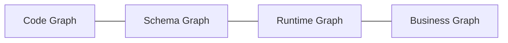

# Concepts

How QGrapho works — product terminology only.

---

## The four graphs

QGrapho continuously builds and updates four graphs. Together they are **QGrapho Graph Intelligence**.



| Graph | Contains | Example question |
|-------|----------|------------------|
| **Code** | Symbols, calls, imports, APIs | Who calls `processPayment`? |
| **Schema** | Tables, columns, migrations, lineage | Which service writes to `orders`? |
| **Runtime** | Traces, service edges, errors | What broke after last deploy? |
| **Business** | Tickets, docs, decisions over time | Why did we choose Redis over Memcached? |

Agents query graphs first. Full-repo text search is a fallback, not the default.

---

## Product components

| Name | Role |
|------|------|
| **QGrapho Console** | Coordinator UI — sessions, swarm, MCP tools |
| **QGrapho Agent Engine** | Executes tasks — shell, git, tests, PRs |
| **QGrapho Graph Intelligence** | Indexes and queries the four graphs |
| **QGrapho Model Router** | Routes text + vision + docs + media to the best provider/model |
| **QGrapho Event Bus** | Async jobs and graph refresh (optional early) |
| **QGrapho Insights** | Traces, cost, evals (optional early) |

---

## Autonomous loop

Every agent task follows the same loop:

```text
Query graphs → Plan → Execute → Verify → Ship → Refresh graphs
```

| Step | What happens |
|------|--------------|
| Query | Agent Engine asks Graph Intelligence for callers, schema, runtime, business context |
| Plan | Console + Model Router pick model for task type |
| Execute | Agent Engine edits code, runs commands |
| Verify | Tests and checks (e.g. E2E verification) |
| Ship | PR, deploy, or ticket update |
| Refresh | Graph Intelligence re-indexes affected areas |

---

## Native by default

QGrapho is designed to run **without** Podman, Docker, or Kubernetes on day one.

- Console and Agent Engine run as **native processes**  
- Graph store can be **embedded files** on disk  
- Model inference uses **your chosen provider** (cloud or local Ollama)  

Containers and K8s are **optional profiles** for isolation and scale — not prerequisites.

---

## Glossary

| Term | Definition |
|------|------------|
| **Episode** | A chunk of business context (ticket thread, doc, decision) stored in the Business Graph |
| **Index** | Build or refresh graph data for a repository |
| **Profile** | Deployment mode: `native`, `isolated`, or `scale` |
| **Swarm** | Multiple agent sessions coordinating on one repo |
| **Workspace** | Directory the Agent Engine is allowed to modify |
| **Modality** | Input/output type: text, image, video, audio, doc, embed |
| **Route** | Config key (`vision`, `doc`, `code`, …) → `provider/model` |

See **[Capabilities & modalities](capabilities.md)** for the full matrix.

---

## Scale path

| Stage | Estate size | Typical profile |
|-------|-------------|-----------------|
| 1 | One repo | `native` |
| 2 | Team, few services | `native` + Event Bus |
| 3 | Many services | `isolated` or server |
| 4 | Enterprise | `scale` (K8s optional) |

You do not need stage 4 to get value from stage 1.
