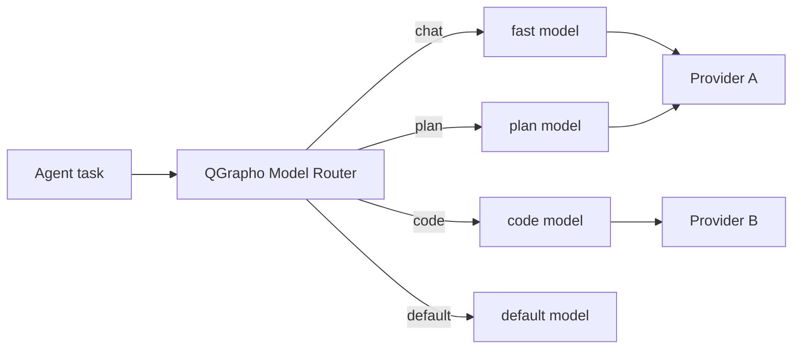

# Models & providers

QGrapho works with **any OpenAI-compatible provider**. You bring your own keys, your own models, your own hardware.

**Hosted inference is optional.** Connect any OpenAI-compatible provider — cloud or local.

---

## Super easy setup (30 seconds)

```bash
qgrapho init
```

The wizard asks:

1. **Which provider?** — pick from smart suggestions (or custom URL)  
2. **API key** — stored in env var, never in git  
3. **Workspace** — folder to index and work on  

Done. One file: `~/.qgrapho/config.toml`

---

## Smart suggestions

QGrapho routes by **task type and modality** — text, vision, documents, images, video, audio, embeddings.

| Task | Route key | Typical model |
|------|-----------|---------------|
| Quick chat | `chat` | fast text model |
| Code edits | `code` | strong coder |
| Architecture | `plan` | long-context / thinking |
| Screenshot / UI | `vision` | multimodal (gpt-4o, kimi-k2.6) |
| PDF / RFC | `doc` | long-context multimodal |
| Diagram / whiteboard | `diagram` | vision model |
| Generate image | `image_out` | dall-e, Grok Imagine |
| Transcribe audio | `audio_in` | whisper |
| Speak text | `audio_out` | TTS |
| Semantic search | `embed` / `search` | embedding model |
| Agent + tools | `agent` | grok-4.3, kimi-k2.6 |

Full matrix: **[Capabilities & modalities](capabilities.md)**

```toml
[routing]
chat = "openai/gpt-4o-mini"
code = "openai/gpt-4o"
vision = "openai/gpt-4o"
doc = "moonshot/kimi-k2.6"
image_out = "openai/dall-e-3"
embed = "openai/text-embedding-3-small"
```

Override per session in the console: `/model openai/gpt-4o`

---

## Add unlimited providers

Each provider is one `[[providers]]` block. Add as many as you need.

```toml
[[providers]]
id = "openai"
label = "OpenAI"
base_url = "https://api.openai.com/v1"
api_key_env = "OPENAI_API_KEY"
enabled = true

  [[providers.models]]
  id = "gpt-4o"
  tags = ["code", "plan"]

[[providers]]
id = "company"
label = "My company gateway"
base_url = "https://llm.internal.corp/v1"
api_key_env = "CORP_LLM_KEY"
enabled = true

  [[providers.models]]
  id = "internal-coder-v2"
  tags = ["code"]
```

Set secrets via environment:

```bash
export OPENAI_API_KEY="sk-..."
export CORP_LLM_KEY="..."
```

---

## Preset catalog

Enable in `config.toml` or run `qgrapho provider add <preset>`.  
Copy-paste blocks live in [`config/presets/`](../config/presets/).

### Major providers

| Preset | Base URL | Key env | Flagship models |
|--------|----------|---------|-----------------|
| **openai** | `https://api.openai.com/v1` | `OPENAI_API_KEY` | gpt-4o, gpt-4o-mini |
| **deepseek** | `https://api.deepseek.com` | `DEEPSEEK_API_KEY` | **deepseek-v4-flash**, **deepseek-v4-pro** |
| **moonshot** | `https://api.moonshot.ai/v1` | `MOONSHOT_API_KEY` | **kimi-k2.6**, kimi-k2.5, kimi-k2-turbo-preview, kimi-k2-thinking |
| **grok** | `https://api.x.ai/v1` | `XAI_API_KEY` | **grok-4.3**, grok-build-0.1, grok-4.20-* |
| **anthropic** | Your proxy / compatible gateway | `ANTHROPIC_API_KEY` | claude-* |
| **ollama** | `http://localhost:11434/v1` | *(none)* | qwen2.5-coder, llama3.2, … |
| **openrouter** | `https://openrouter.ai/api/v1` | `OPENROUTER_API_KEY` | DeepSeek, Kimi, Grok via one key |
| **azure** | `https://{resource}.openai.azure.com/...` | `AZURE_OPENAI_API_KEY` | Enterprise |
| **qgrapho-cloud** *(optional)* | `https://qgrapho.quanvio.com/v1` | `QGRAPHO_CLOUD_API_KEY` | Optional QGrapho Cloud |

**Moonshot China:** use `https://api.moonshot.cn/v1` instead of `.ai`.

**Model IDs change** — always verify with:

```bash
qgrapho model list --provider deepseek
qgrapho model list --provider moonshot
qgrapho model list --provider grok
```

---

## DeepSeek (V4 Flash + V4 Pro)

Best value for coding agents. OpenAI-compatible.

| Model | Tags | Use for |
|-------|------|---------|
| `deepseek-v4-flash` | fast, chat, code | Daily work, low cost, 1M context |
| `deepseek-v4-pro` | code, plan, reason | Hard refactors, architecture, thinking mode |

```bash
export DEEPSEEK_API_KEY="sk-..."
qgrapho provider add deepseek
```

Docs: [DeepSeek API](https://api-docs.deepseek.com/)

---

## Moonshot / Kimi (K2.6, K2.5, Turbo, Thinking)

Strong agent and coding models. 256K context.

| Model | Tags | Use for |
|-------|------|---------|
| `kimi-k2.6` | agent, code, plan | **Current flagship** (replaces older K2 previews) |
| `kimi-k2.5` | code, plan | Previous gen, still capable |
| `kimi-k2-turbo-preview` | fast, agent | High tokens/sec |
| `kimi-k2-thinking` | plan, reason | Multi-step tool use |
| `moonshot-v1-8k` | chat, fast | Light tasks |

```bash
export MOONSHOT_API_KEY="sk-..."
qgrapho provider add moonshot
```

Docs: [Kimi models](https://platform.moonshot.ai/docs/models)

---

## Grok / xAI (Grok 4.3, Build)

| Model | Tags | Use for |
|-------|------|---------|
| `grok-4.3` | agent, code, plan | Flagship — chat + reasoning modes |
| `grok-build-0.1` | code | Coding-focused |
| `grok-4.20-0309-reasoning` | plan, reason | Deep reasoning |
| `grok-4.20-0309-non-reasoning` | fast, chat | Low latency |

```bash
export XAI_API_KEY="xai-..."
qgrapho provider add grok
```

Docs: [xAI models](https://docs.x.ai/developers/models)

---

## Smart multi-provider routing (recommended)

Use **different providers per task** — cheapest model for chat, strongest for code:

```toml
[models]
default_provider = "deepseek"
default_model = "deepseek-v4-flash"

[routing]
chat   = "deepseek/deepseek-v4-flash"    # cheap, fast
fast   = "deepseek/deepseek-v4-flash"
code   = "deepseek/deepseek-v4-pro"      # hard edits
plan   = "moonshot/kimi-k2.6"             # long agent plans
agent  = "grok/grok-4.3"                 # tool-heavy tasks
reason = "moonshot/kimi-k2-thinking"     # multi-step reasoning
embed  = "openai/text-embedding-3-small"
```

QGrapho picks the route from task type. Override anytime: `/model moonshot/kimi-k2.6`

Run `qgrapho model suggest` to print your routing table with cost/latency hints.

---

## Legacy preset table (quick reference)

| Preset | Base URL | Key env | Best for |
|--------|----------|---------|----------|
| **openai** | `https://api.openai.com/v1` | `OPENAI_API_KEY` | General use |
| **anthropic** | Your proxy or compatible gateway | `ANTHROPIC_API_KEY` | Strong reasoning |
| **ollama** | `http://localhost:11434/v1` | *(none)* | Local, free, private |
| **azure** | `https://{resource}.openai.azure.com/...` | `AZURE_OPENAI_API_KEY` | Enterprise Azure |
| **openrouter** | `https://openrouter.ai/api/v1` | `OPENROUTER_API_KEY` | Many models, one key |
| **qgrapho-cloud** *(optional)* | `https://qgrapho.quanvio.com/v1` | `QGRAPHO_CLOUD_API_KEY` | Optional QGrapho Cloud |

---

## Optional: QGrapho Cloud

**QGrapho Cloud** is optional hosted inference from Quanvio — same OpenAI-compatible API, no vendor lock-in. Enable when the endpoint is live; until then, use any BYOK provider above.

Only enable if **you** choose QGrapho Cloud:

```toml
[[providers]]
id = "qgrapho-cloud"
label = "QGrapho Cloud"
base_url = "https://qgrapho.quanvio.com/v1"
api_key_env = "QGRAPHO_CLOUD_API_KEY"
enabled = false
suggested = true

  [[providers.models]]
  id = "qgrapho-default"
  tags = ["chat", "code"]
```

The `base_url` can be updated anytime (for example when you move to a custom domain). BYOK providers are unaffected.

If you use another provider, leave this block commented out or `enabled = false`.

---

## CLI helpers

```bash
qgrapho provider list              # all configured providers
qgrapho provider add openai          # wizard: add preset
qgrapho provider add custom          # wizard: any base URL
qgrapho provider use openai          # switch default
qgrapho model list                 # models for active provider
qgrapho model suggest              # show smart routing table
qgrapho doctor --models            # test each enabled provider
```

---

## How routing works



1. Agent declares task type (or QGrapho infers from prompt).  
2. Router looks up `[routing]`.  
3. Falls back to `default_model` if route missing or provider down.  
4. `qgrapho doctor --models` validates keys and latency.

---

## Requirements

| Required | Optional |
|----------|----------|
| At least **one** enabled provider with a valid API key | QGrapho Cloud |
| OpenAI-compatible `/v1/chat/completions` | Search URL (any provider) |
| | Local Ollama (no key) |

No GPU required unless **you** run local models.

---

## See also

- [Capabilities & modalities](capabilities.md) — vision, image, video, audio, docs, giant-scale patterns  
- [Configuration](configuration.md) — full `config.toml` reference  
- [Getting started](getting-started.md) — first run  
